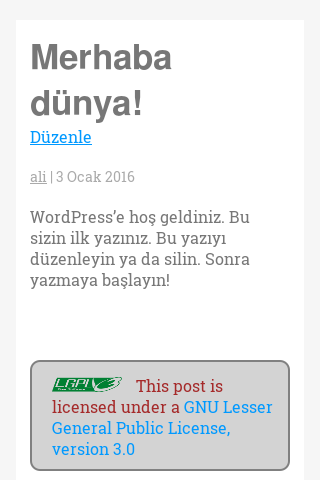
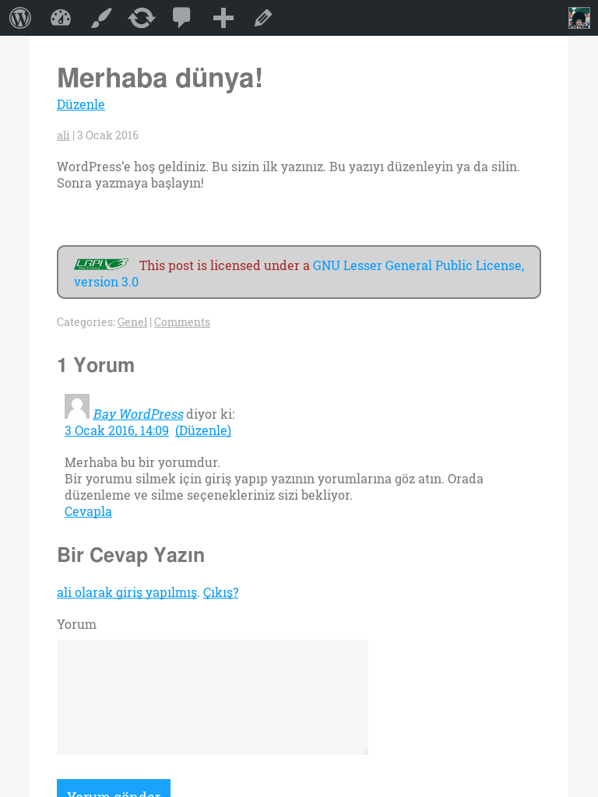

#wp-license-me

WordPress yazılarının altına lisans bildirimi ekler. Hangi lisans türünde bildirim yapılacaksa onu seçerek gösterebilirsiniz.

Admin panelinde yer alan License Post sekmesindenden ayarlayabilirsiniz.

Bazı ekran görüntüleri

-----------------------

-----------------------

-----------------------

